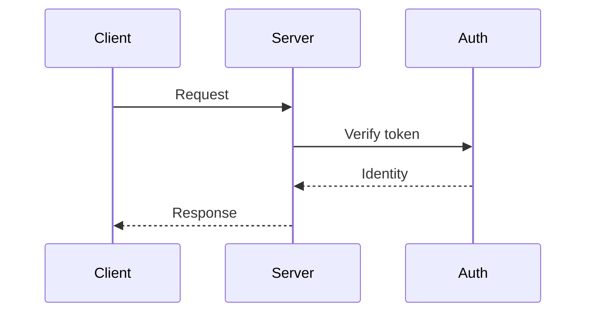

---
# This is the workflow-advisor spec template. Fields in this front-matter
# are read by the skill to keep the sidecar in sync. Editing front-matter
# directly is fine — the skill observes changes on next reconcile and
# treats them as a manual edit (with classification).
#
# Required fields (skill will not advance lifecycle without them):
id:                                    # zero-padded integer, e.g. "0042"
title:                                 # short human-readable title
state: draft                           # draft | in-review | approved | superseded
author:                                # GitHub handle of the spec author

# Optional but recommended:
created:                               # ISO 8601 date, e.g. 2026-05-09
related_specs: []                      # list of spec ids this builds on or relates to
supersedes: []                         # list of spec ids this replaces
superseded_by: null                    # set when a successor spec is approved
linked_issues: []                      # GitHub issue numbers this spec addresses
linked_prs: []                         # PRs implementing this spec (skill maintains this)

# Skill-managed (do not edit by hand; skill will overwrite):
revision: 1
content_hash: null
last_observed: null
last_change:
  classification: null
  classified_by: null
  rationale: null
---

# {Title}

> One-paragraph summary of what this spec proposes. A reader should be
> able to understand the gist of the change from this paragraph alone.

## Context

What's the situation that made this spec necessary? Include:

- The current state of the system relevant to this change.
- The constraint, problem, or opportunity being addressed.
- Any prior decisions (link to ADRs, prior specs) that bear on this.

This is the section a reviewer reads to decide whether they agree with
the framing — not just the proposed change.

## Goals and non-goals

**Goals**
- What this spec is trying to achieve. One bullet per goal.
- Each goal is testable in principle (you can imagine a future check
  that verifies it).

**Non-goals**
- Things that are explicitly out of scope. Be specific. "Performance" is
  not a non-goal; "reducing p99 latency below 50ms" is. Listing
  non-goals prevents scope creep during review and implementation.

## Proposed approach

The substance. What is being proposed?

Structure this section however suits the change. Common patterns:

- **For new features:** describe the user-visible behavior, then the
  system design that produces it.
- **For refactors:** describe the current architecture, what's wrong
  with it, the new architecture.
- **For interface changes:** specify the interface contract first,
  then how it differs from current.
- **For policy changes:** state the policy clearly, list cases it
  governs, identify ambiguous edge cases.

Use diagrams when they help. Mermaid renders in GitHub:

## Tradeoffs and alternatives

Decisions that landed here without being made consciously usually leak
back as confusion. List the alternatives considered and why they were
rejected.

| Option | Pros | Cons | Decision |
|---|---|---|---|
| (Approach A — chosen) | ... | ... | Selected |
| (Approach B) | ... | ... | Rejected because ... |
| (Status quo) | ... | ... | Rejected because ... |

If the team adopts ADRs (`profiles.spec-driven` with ADR enabled), the
deeper architectural decisions can live in linked ADRs and this section
can summarize.

## Impact on roles and audiences

This section is required when the **documentation profile** is enabled
and helps the skill identify which audience docs are needed.

| Role / audience | Impact | Doc needed |
|---|---|---|
| developer | New API endpoints to integrate against | integration_guide |
| operator | New environment variables, scaling considerations | deployment_guide |
| sre | New metrics, new alert thresholds | runbook + alert_response_guide |
| support | New error messages users may see | troubleshooting_guide, faq |
| security | Auth flow change | threat_model_summary |
| product | User-visible feature | feature_overview |
| end_user | New UI elements / behavior change | user_guide, release_notes |
| legal_compliance | Handles user PII | compliance_impact_note |

Roles not impacted: list as "no impact" with one-line rationale, so the
skill knows the omission was deliberate.

## Test plan summary

When the **testability profile** is enabled, summarize the test
strategy here. The full test plan lives in
`docs/test-plans/{spec-id}-{slug}.md` (linked below) but a summary in
the spec helps reviewers understand the testing intent.

- Unit tests covering: ...
- Integration tests covering: ...
- Contract tests for changed APIs.
- E2E coverage for: ...
- Performance baselines and targets: ...
- Security tests: ...

> Linked test plan: `docs/test-plans/{spec-id}-{slug}.md`

## Observability summary

When the **observability profile** is enabled, summarize what
instrumentation this spec requires. The full observability plan lives
separately.

- **Success metric:** how do we know the feature is working?
- **Failure mode signals:** how do we detect it's broken?
- **SLI / KPI:** the number that tells us its health.
- **Alert thresholds:** when should this wake someone?
- **Dashboard:** where do we look?

> Linked observability plan: `docs/observability/{spec-id}-{slug}.md`

## Security considerations

When the **security profile** is enabled, summarize the security
implications. A separate threat model lives in
`docs/security/threat-models/` if the area triggers one.

- Authentication / authorization changes.
- New trust boundaries.
- Data sensitivity changes.
- Attack surface changes.
- Secrets, keys, or credentials affected.

> Linked threat model: `docs/security/threat-models/{spec-id}-{slug}.md`
> (if required by area classification)

## Compliance impact

When the **compliance profile** is enabled and the spec touches
regulated data or processes, document the compliance implications.

- Frameworks affected: SOC2 / HIPAA / GDPR / PCI / ...
- Data handling changes.
- Audit trail changes.
- Retention policy changes.

> Linked compliance assessment: `docs/compliance/assessments/{spec-id}-{slug}.md`

## Rollout plan

How does this change reach production?

- **Feature flag?** If yes, describe the flag and rollout strategy
  (which cohort, what percentage, what duration).
- **Migration?** If schema or data migrations are involved, link the
  migration plan.
- **Backwards compatibility?** What can we do if we need to roll back?
- **Validation:** how will we verify it's working in production
  during the post-release validation window? (Cross-references the
  observability plan.)

## Open questions

Things the spec author isn't sure about, with suggested resolutions.
Reviewers may resolve these in comments, or leave as known unknowns
the team accepts.

- **Question 1:** ...
- **Question 2:** ...

## Approvals

The skill maintains the approval state in the sidecar. This section is
optional (front-matter is the source of truth) but useful for human
readers:

| Role | Approver | Status | Date |
|---|---|---|---|
| architect | @marlin | ✓ approved | 2026-05-09 |

---

## Notes for the spec author

A few rules the workflow-advisor enforces around this spec:

- **Editing this file** triggers a reconcile pass that classifies the
  change. Editorial fixes (typos, formatting) leave state untouched.
  Substantive changes (anything modifying the proposed approach, goals,
  interfaces, or impact) reset the spec to `state: in-review` and
  flag dependent PRs.

- **Approval** happens via `/approve-spec {spec-id}` posted as a comment
  on a PR or tracking issue, by an authorized member of the architect
  role. The skill does not consider approval-via-edit-of-frontmatter as
  authoritative — the slash command is the audit-trail-friendly path.

- **Supersession.** If this spec is later superseded, do not delete it.
  The successor spec posts `/supersede #{spec-id}` and the skill links
  them. This file's `state` becomes `superseded` with a `superseded_by`
  pointer.

- **Linkage.** PRs referencing this spec via `Spec: docs/specs/{file}`
  in their body are automatically linked. The `linked_prs` field in
  front-matter is maintained by the skill.
